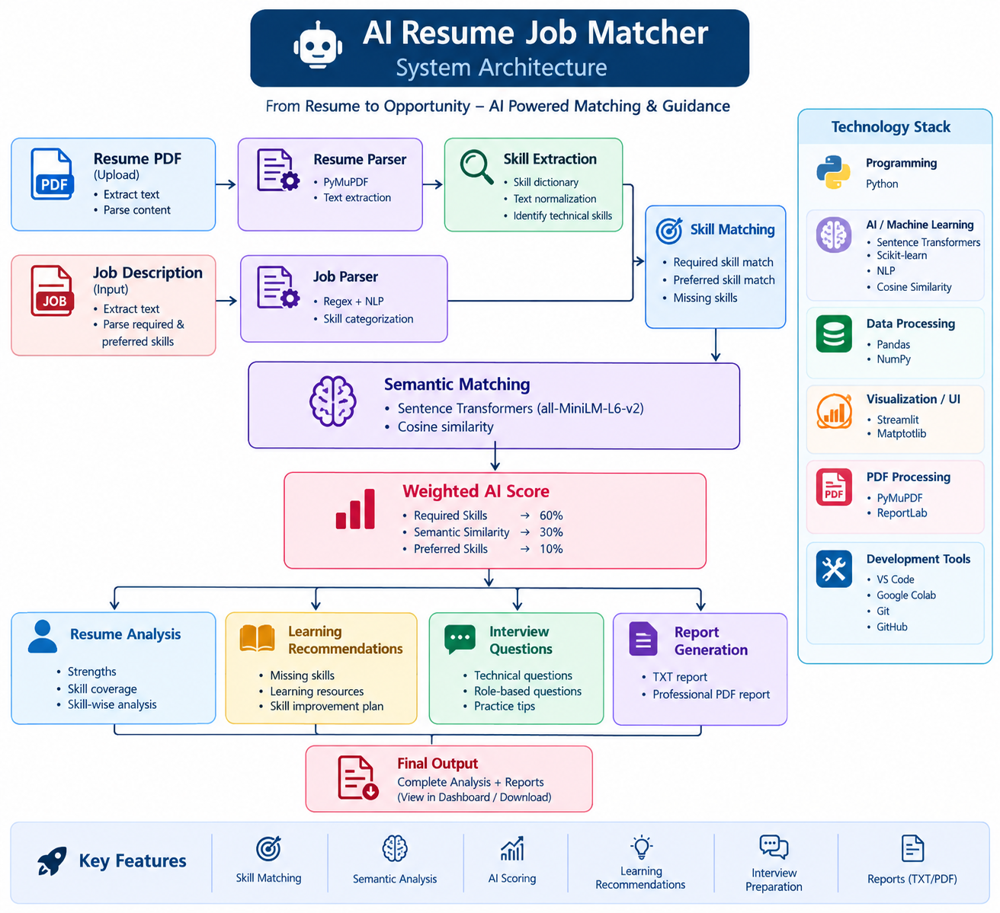

# 🤖 AI Resume Screening & Job Matching System

An AI-powered resume screening and job matching system that analyzes resumes against job descriptions using **skill matching, semantic similarity, and weighted scoring**.

The application helps identify matching skills, missing skills, learning recommendations, and interview questions based on a candidate's resume and a target job description.

---

## 🚀 Live Demo

👉 **[Try the AI Resume Job Matcher](https://airesumejobmatcher-h9eccjivhop8kam2pgjfrm.streamlit.app/)**

## 💻 GitHub Repository

👉 **[View Source Code](https://github.com/sanjana580/AI_Resume_Job_Matcher)**

---

## ✨ Features

- 📄 Upload resume PDF
- 📝 Enter job descriptions
- 🔍 Automatic resume text extraction
- 🧠 AI-based semantic similarity
- 🛠️ Skill extraction and matching
- 📊 Required skill matching
- ⭐ Preferred skill matching
- ❌ Missing skill identification
- 📈 Overall compatibility score
- 💡 Personalized learning recommendations
- 🎯 Resume improvement suggestions
- 🎤 Skill-based interview questions
- 📥 Download analysis reports
- 📑 Generate professional PDF reports
- 📊 Visual skill analysis dashboard

---

## 🏗️ System Architecture



### Workflow

```text
Resume PDF + Job Description
            │
            ▼
     Resume Parser
            │
            ▼
     Skill Extraction
            │
            ▼
   Required / Preferred
      Skill Matching
            │
            ▼
    Semantic Similarity
            │
            ▼
      Weighted Score
            │
            ▼
     Final Analysis
            │
      ┌─────┼─────┐
      ▼     ▼     ▼
   Missing  Skills  Recommendations
   Skills  Match    Interview Questions